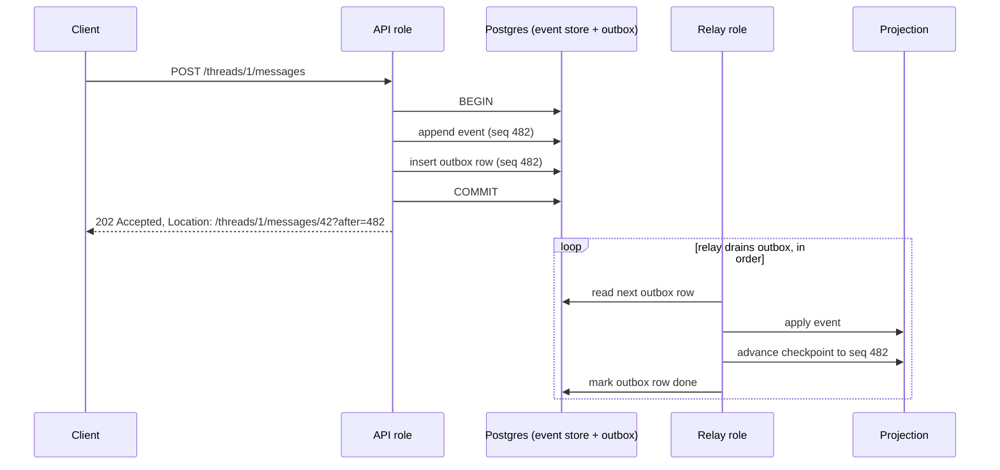
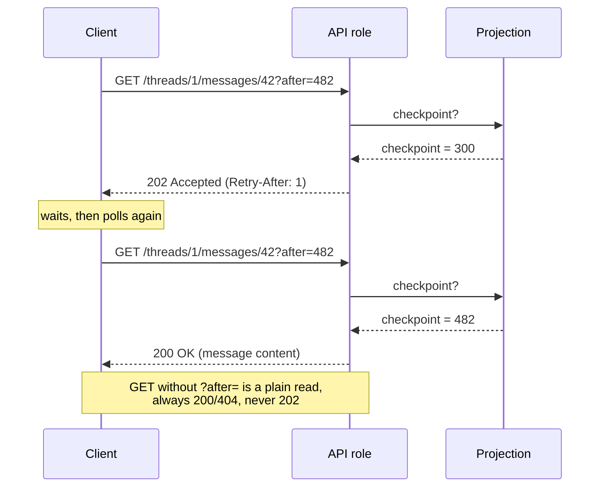

# Event sourcing & the write path

See `docs/architecture.md` for the ports/CQRS shape this sits inside. This doc is just the write path itself: how a write becomes an event, how that event reaches a projection, and how a caller knows when it's safe to read their own write.

Every state change is captured as an event, not a row mutation - this is what makes full audit retrieval possible. It also gives us a clean answer to messages being editable/deletable: an edit is a `MessageEdited` event, a delete is a `MessageDeleted` event, not an UPDATE/DELETE. The log itself is never mutated.

The write path, in practice:

1. A command comes in (e.g. `POST /threads/{id}/messages`)
2. The in port validates it and appends the resulting event(s) to the event store
3. In the same db transaction, a row is written to a transactional outbox - this avoids the dual-write problem between the event store and whatever updates the projections
4. CE responds `202 Accepted` with a `Location` header for the resource - the write is durable, but not necessarily reflected in any projection yet
5. A background relay drains the outbox and updates projections asynchronously

Scaling the API and scaling the outbox relay are different problems, so we don't force them through the same pool. It's one Docker image, but two roles:

- The **API role** scales horizontally with no special coordination - every write is just a normal db transaction, and Postgres already handles concurrent writers safely.
- The **relay role** runs as a single active instance, draining the outbox in order. One consumer means no locking and no out-of-order processing, and it sidesteps needing the projections to be idempotent. If we want the relay to be highly available later, the standard fix is a Postgres advisory lock for leader election (run multiple replicas, only the lock holder processes, failover is automatic) - not needed for now.

Read models are eventually consistent with the event log by design - worth being upfront about, since it directly affects demo UX (an htmx page posting a message may not immediately see it if it re-fetches from a projection).

This is a standard, plain-HTTP pattern, not anything client-library-specific: poll the `Location` with `GET`. While the write hasn't landed in a projection yet, the response is `202 Accepted` again (optionally with a `Retry-After` header to pace the next poll); once it has, the response is a normal `200` with the real representation. Any HTTP client - browser, htmx, curl, a machine JSON client - already knows to stop polling once it stops getting `202`, so no special "stop" signal is needed.

The message resource itself has a stable URL (e.g. `/threads/1/messages/42`), and a plain `GET` on that URL is always an ordinary, unconditional read - `200`/`404`, never `202`. The `202`-while-pending behaviour only applies to a specific caller's specific write, not to the resource in general, so it has to be addressed separately from the bare URL:

1. Every event gets a monotonic sequence number when it's appended to the event store
2. The `202` response's `Location` carries that sequence as a query param - e.g. `Location: /threads/1/messages/42?after=482` - rather than pointing at the bare resource URL
3. The relay tracks a checkpoint per projection - "applied up to sequence N" - which it already needs anyway to resume correctly after a restart
4. `GET /threads/1/messages/42?after=482` compares the two: `200` once the projection's checkpoint reaches 482, `202` until then. `GET /threads/1/messages/42` with no `after` param is unaffected and always returns current state.

